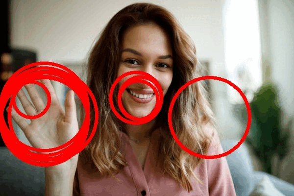
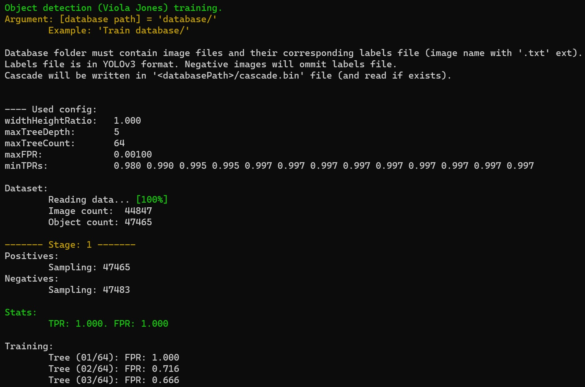

# Viola-Jones training and testing 

An improved and faster variant of a popular [Viola and Jones](https://www.cs.cmu.edu/~efros/courses/LBMV07/Papers/viola-cvpr-01.pdf) algorithm is implemented in C++ according to [this paper](https://arxiv.org/pdf/1305.4537.pdf).

Essentially, the following changes are made comparing the standard Viola and Jones algorithm:   
1. binary pixel comparisons replace Haar features (integral image not needed)
2. full trees are used instead of binary stumps
3. GentleBoost algorithm is used instead of AdaBoost

The implementation runs both on Windows and Linux, where the only dependency is OpenCV library used for media reading. The code has the following characteristics:  
1. it is created with readability in mind (where performance is also decent)
2. it follows C# flavour of coding
3. the algorithm is well commented
4. both training and test app use parallelism (via threads)
4. simple compilation is done via scripts for Windows and Linux

The implementation does not use STL, but it is substituted with a minimal implementation of classes and data structures following C# (.NET) CoreLib interface.
Therefore, the entire codebase, both the recreated CoreLib and the algorithm is heavily influenced with C# (and .NET) style of coding as mentioned before.

## Compiling
Compilation scripts (Windows and Ubuntu) are located under *scripts* folder.

On Windows, VS 2022 C++ tools must be installed along with the statically compiled OpenCV 4.x.

Ubuntu uses libopencv (installed via apt get) and clang++ compiler.

To compile just run an appropriate script, where additional info is written inside a script if needed.

## Testing

The included Test app enables a user to detect objects on an image, a camera or a video, as shown below:

The app assumes that a 'cascade.bin' (a trained classifier) is in the same folder as the app.   
Image/frame size does not matter.

**WARNING**: detections are not clustered, hence you will see more false positives than anticipated. If detections are clustered, clusters may be then filtered by their confidence which is the sum of all detection confidences.

## Training

In order to train a new cascade with your own data do the following:   
1. collect a dozen of thousands of samples (50k+) of entire (not cropped) images and put them in a database folder (or subfolders - the structure does not matter).
2. annotate them and write objects ROIs in <im_name>.txt label file which follows YOLOv3 data structure. In summary, rows of (classId, center X, center Y, width, height). All coordinates are normalized by their image size. ClassId is discarded attribute.
3. Run Train <database path>. It will create a config file inside database folder which you can edit (a message will be clearly displayed).
4. Re-run the previous command. It will start training process. The output should be similar as in the following screenshot:

### Included cascade
Trained cascade (included in a release) is for open hand detection, which has 20 stages and it was trained on around 60k samples. The training procedure is fast in the beginning, while its speed declines over time because false positive mining is harder as the classifier gets better. It may take **several days** until a satisfactory FPR is reached.

### Config file
Config file is automatically created in <database path> when Train app is started if it does not exist. It contains the following properties:

1. widthHeightRatio - width to height ratio to enforce when reading object ROIs. The classifier will be trained to recognize object of this width/height ratio. Values: [0.1 - 1.0].

2. maxTreeDepth - max tree depth for all trees in a cascade. Large values produce trees that are more prone to overfit. Good values: [4 - 7].

3. maxTreeCount - max tree count per each stage. Each stage contains a minimal number of trees to reach at least 50% FPR comparing the last stage. It is safe to put large values, because they will probably not be reached, and if they are they will be hit in later stages of a cascade where an overall FPR will be low. Good values: [64 - 128].

4. maxFPR - Target FPR for a cascade. The cascade will be trained until the specified FPR is reached. Good values: [0.001 - 0.0001] (0.1% - 0.01%).

5. minTPRs - A list of minimal TPR values. Each value represents a minimal TPR for each stage. The number of values dictates the maximum number of stages in a cascade. Good values: [0.970 - 0.999].

#### Remarks
If some keys are missing, default values will be used.   
If a training procedure is started on an existing cascade, a new stage will be added and widthHeightRatio in addition to maxTreeDepth will be read from the cascade, not from the specified config file. 

### Training process

The training process first creates a config file as discussed. The next run, executes the  training procedure which can be described as follows:

1. All label files are read in the memory and consumed by positive and negative dataset.

2. Patches are being sampled by a positive and a negative dataset. The positive dataset returns a collection of image patches where objects are. In addition to that it slightly jitters ROI to force the classifier to learn more diverse samples. Negative dataset returns a collection of randomly sampled negative patches, i.e. patches that do not contain any objects.

3. When patches are sampled, a boosted tree classifier is being trained and trees are added until stage FPR is dropped below 0.5. Then a stage threshold is determined such that stage TPR and stage FPR is reached. 

4. The described procedure of a single stage training is repeated until the specified overall max FPR is reached or the number of stages is reached. 

## Remarks
Check the *Releases* to find pre-compiled binaries for your system.    
There you will find a trained hand classifier as well.  